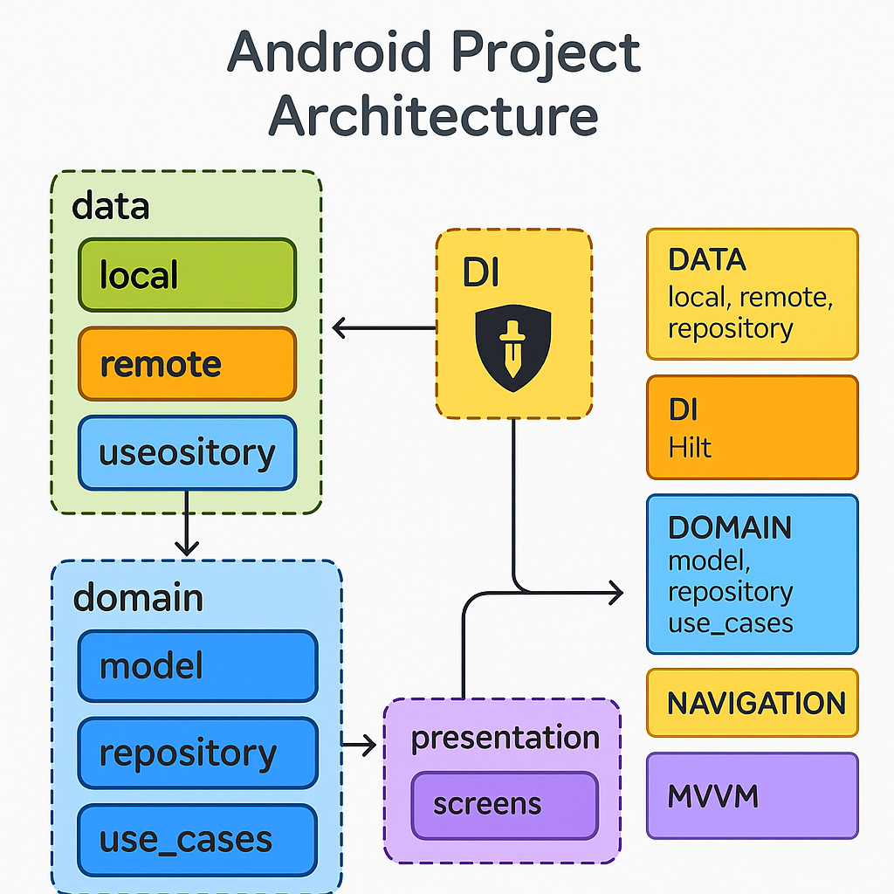

# Arquitetura do Projeto Android (MVVM + Clean Architecture)



Este projeto utiliza **MVVM** junto com princípios de **Clean Architecture**. As principais camadas e pacotes do projeto são:

## 📁 data

Contém toda a lógica de acesso a dados, seja local ou remoto.

- **local**: Classes responsáveis por armazenamento local, como bancos de dados (ex: Room), SharedPreferences, DataStore.
- **remote**: Comunicação com APIs externas, utilizando Retrofit para requisições HTTP.
- **repository**: Implementações dos repositórios declarados na camada `domain`. Eles decidem se os dados vêm do `local` ou do `remote`.

> **Responsabilidade**: Fornecer dados para a camada de `domain` de forma transparente (não importa para o `domain` se é local ou remoto).

---

## 📁 domain

Camada de regra de negócio e entidades puras. Totalmente independente de frameworks Android.

- **model**: Modelos/Entidades que representam os dados do domínio do negócio (Ex: `User`, `Product`, `Order`).
- **repository**: Interfaces (contracts) dos repositórios que serão implementadas na camada `data`.
- **use_cases**: Casos de uso que encapsulam a lógica de negócios específica (Ex: `GetUserUseCase`, `LoginUseCase`).

> **Responsabilidade**: Definir "o que fazer", sem se preocupar com "como fazer" (isso é papel da `data`).

---

## 📁 di

Camada de **Dependency Injection**.

- **Objetivo**: Fornece as instâncias necessárias para o app.
- Utiliza **Hilt** para injetar dependências como Retrofit, Repositórios, UseCases, ViewModels.

Exemplo de classes aqui:

- `NetworkModule`
- `RepositoryModule`
- `UseCaseModule`
- `ViewModelModule`

---

## 📁 navigation

Gerencia a navegação entre as telas.

- Define todas as rotas e a configuração da navegação (Ex: com `NavHost`, `NavController` no Compose).

Exemplo:

- `Screen.kt` (definindo rotas)
- `NavGraph.kt` (definindo o fluxo de navegação)

---

## 📁 presentation

Responsável pela interface de usuário (UI) e interação com ViewModels.

- **screens**: Cada tela da aplicação fica separada em sua própria pasta, contendo:
    - Composables da tela
    - ViewModels (seguindo MVVM)
    - EventListeners, States

> **Responsabilidade**: Mostrar os dados ao usuário e lidar com ações do usuário, comunicando-se com os `use_cases` via `ViewModel`.

---

# 🛠️ Tecnologias Utilizadas

- **Hilt**: Injeção de dependência.
- **Retrofit**: Comunicação com APIs REST.
- **MVVM**: Arquitetura de separação de responsabilidades.
- **Jetpack Compose**: Construção declarativa de UI.
- **Clean Architecture**: Organização de responsabilidades em camadas independentes.

---

# 📚 Fluxo Resumido

```plaintext
Presentation (View + ViewModel)
         ↓
     UseCases (Domain)
         ↓
    Repository Interface (Domain)
         ↓
Repository Implementation (Data)
         ↓
   Local / Remote Data Sources
```

